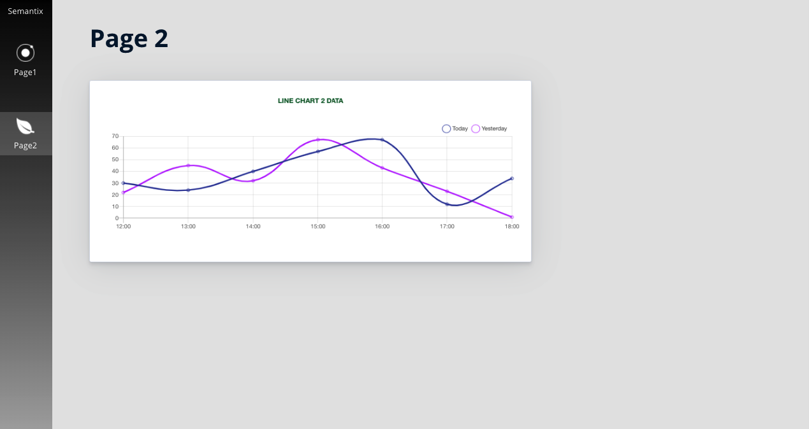

# Chart JS Pages :bar_chart:
This is a **responsive single-page Web application** :computer: developed with React.

#### Check it out here: https://master.d28h9208pzbo7a.amplifyapp.com/

 

## Technologies

- JavaScript ES6
- React
- Hooks
- Chart.js
- React Chart.js 2
- AJAX / Axios
- AWS Amplify Console Deploy

## Contributing
>This is an open-source and free software. Please, feel free to collaborate =).

1. Fork it 
2. Create your feature branch (`git checkout -b feature/fooBar`)
3. Commit your changes (`git commit -am 'Add some fooBar'`)
4. Push to the branch (`git push origin feature/fooBar`)
5. Create a new Pull Request

## Our team

Developed with :heart: by [**Fernando Borrelli**](https://github.com/flborrelli)

